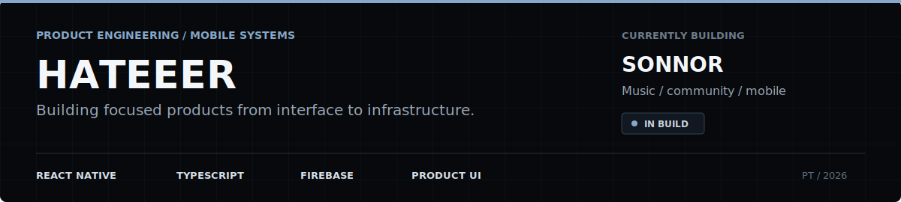
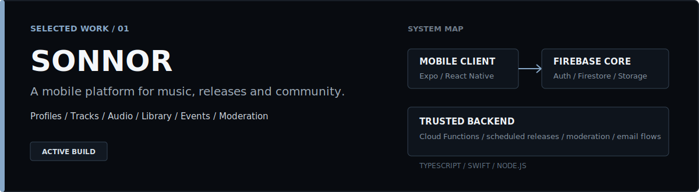
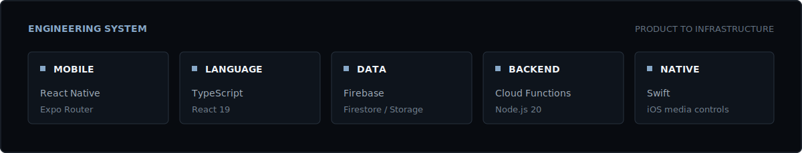

  

  

## Building products with a point of view

I build mobile systems where interface, media and backend behavior feel like one coherent product. My work is focused on product quality, clear architecture and the details that make software feel intentional.

Currently building **Sonnor**, a mobile platform for music, releases, discovery and community.

  <a href="https://github.com/HATEEER/Sonnor"><strong>Explore Sonnor</strong></a>
  &nbsp;&nbsp;/&nbsp;&nbsp;
  <a href="mailto:wesleyjessen62@gmail.com"><strong>Contact</strong></a>

## Selected work

## Engineering system

## What I care about

| Product thinking | Engineering quality |
| --- | --- |
| Interfaces with a clear visual voice | Architecture that remains understandable |
| Fast, focused mobile workflows | Reliable data and permission boundaries |
| Media experiences that feel immediate | Small details that survive real use |

## Contact

For product work, collaboration or a serious technical conversation: **[wesleyjessen62@gmail.com](mailto:wesleyjessen62@gmail.com)**

Designed and built with intention.

